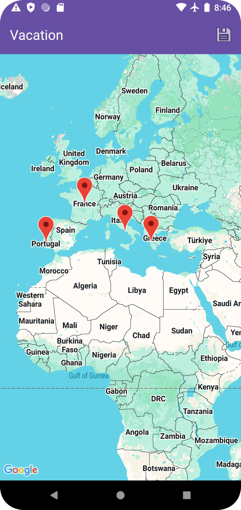

# My Maps - Android Application

## Description

My Maps is an Android application that allows users to create, save, and view their own custom maps with personalized markers. Users can define map titles and add multiple places (markers) with titles and descriptions to each map. This app provides a simple way to keep track of interesting locations or plan itineraries.

## Features

*   **Create Custom Maps:** Users can create new maps by providing a title.
*   **Add Places:** Add markers to your maps by long-pressing on the desired location. Each marker can have a custom title and description.
*   **View Saved Maps:** All created maps are listed on the main screen for easy access.
*   **Display Markers:** When a map is selected, all its saved places are displayed as markers on the Google Map.
*   **Camera Autofit:** The map camera automatically adjusts to show all markers for a selected map.
*   **Data Persistence:** User maps and places are saved locally on the device.
*   **Custom Activity Transitions:** Smooth animations when navigating between screens.

## Screenshots



## Technologies Used

*   **Kotlin:** Primary programming language.
*   **Android SDK:** Native Android development.
*   **Google Maps API:** For displaying maps and markers.
*   **AndroidX Libraries:**
    *   AppCompat
    *   RecyclerView (for displaying lists of maps)
    *   ConstraintLayout
    *   Activity & Fragment KTX
*   **Material Components for Android:** For UI elements like Floating Action Button, Toolbar, Dialogs.
*   **View Binding:** To easily access views in layouts.

## Setup

To build and run this project, you will need to:

1.  **Clone the repository:**
    ```bash
    git clone [your-repository-url]
    ```
2.  **Open in Android Studio:** Open the cloned project in Android Studio.
3.  **Add Google Maps API Key:**
    *   Obtain a Google Maps API key from the [Google Cloud Console](https://developers.google.com/maps/documentation/android-sdk/get-api-key).
    *   Create a `local.properties` file in the root of your project (if it doesn't exist).
    *   Add your API key to `local.properties` like this:
        ```properties
        MAPS_API_KEY=YOUR_API_KEY_HERE
        ```
    *   The project is set up to read this key from `local.properties` and insert it into the `AndroidManifest.xml`.

## How to Use

1.  **Main Screen:** The app opens to a list of your saved maps.
2.  **Create a New Map:**
    *   Tap the Floating Action Button (+) at the bottom right.
    *   Enter a title for your new map and tap "OK".
    *   You will be taken to the map screen.
3.  **Add Markers to a Map:**
    *   On the map screen for a new or existing map, long-press anywhere on the map to add a marker.
    *   Enter a title and description for the marker.
    *   Tap "OK".
    *   You can delete a marker by tapping its info window.
4.  **Save Map:** Tap the "Save" icon in the toolbar on the map creation screen to save the map and its markers.
5.  **View a Map:** Tap on any map in the main list to open it and view its markers.

## Future Enhancements (Optional Ideas)

*   Edit existing markers.
*   Delete maps from the main list.
*   Different marker icons or colors.
*   Search for locations to add markers.
*   Cloud synchronization of maps.

---